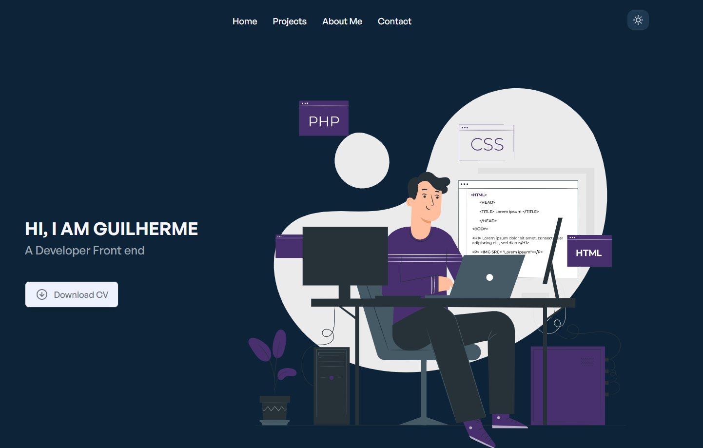

<!-- Title -->
<h1 align="center"> Vue Portfolio </h1>

<!-- Sobre -->
## 🚀 Sobre o Projeto
O repositório Vue Portfolio é um projeto que demonstra um pouco das minhas habilidades de desenvolvimento com Vue.js. Uma combinação perfeita de Vue, Tailwind CSS e outras tecnologias.

Conceitos abordados:

* Estados
* Imutabilidade de estado
* Listas e chaves com Vue
* Componentização
* Vue Router
* Vue X


## 🖼️ Imagens do Projeto
<div align="center">
  
</div>

## 🧰 Tecnologias e Bibliotecas

-  [Vue](https://vuejs.org/guide/introduction.html)
-  [Vue Router](https://router.vuejs.org/)
-  [Vue X](https://vuex.vuejs.org/)
-  [Axios](https://github.com/axios/axios)


## ⚙️ Rodando o Projeto
```bash
# Clone este repositório para a pasta anterior
$ git clone https://github.com/guilherme-studier/vue-portfolio.git
# ou use a opção de download.

# Instale as dependências
$ yarn install
ou
$ npm install

# Executando o Projeto
$ yarn dev 
ou
$ npm dev

# Acesse http://localhost:3000 no seu navagador
```
